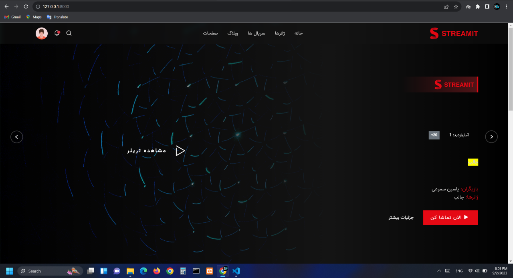

<h1 align="center">Movie subscription site</h1>
<h3 align="center">open source movie subscription site for beginners</h3>
<div align="center" ><a href="https://github.com/YasinSamooei"></a></div>

### Overview
- [Features](#features)
- [Technologies](#technologies)
- [Setup](#setup)
- [Variables](#variables)
- [License](#license)

# Features
- Customized user model
- Password reset and customized password change
- Special panel for users
- Video subscription purchase system
- Blog section
- Special panel for authors of articles and owners of videos
- share in social madia
- notification system with `signals`
- hit-count system for videos
- mysql settings
- file_storage(S3Storage)
- meta tags related to `CEO`
- comment and reply with `ajax`
- like and save with ajax
- progress bar for upload video and image with `ajax`

# technologies
- django
- mysql
- S3 storages
- python-decouple
- black & flake8

# setup
- create .env file and add variables
- ```python manage.py makemigrations```
- ``` python manage.py migrate ```
- ``` python manage.py createsuperuser ```
- ``` python manage.py runserver ```

# variables
- EMAIL_HOST_PASSWORD = 'sample'
- EMAIL_HOST = 'smtp.gmail.com'
- EMAIL_PORT = 587
- EMAIL_HOST_USER = 'sample'
- AWS_ACCESS_KEY_ID = "sample"
- AWS_SECRET_ACCESS_KEY = "sample"
- AWS_S3_ENDPOINT_URL = "sample"

# license
- This project is open source for the practice and access of beginner Django programmers.
- The license of this project is specified under the MIT license in the <a href="https://github.com/YasinSamooei/Movie_subscription_site/blob/main/LICENSE">license</a> file.
# programmer : <a href="https://github.com/YasinSamooei">Yasin Samooei</a>